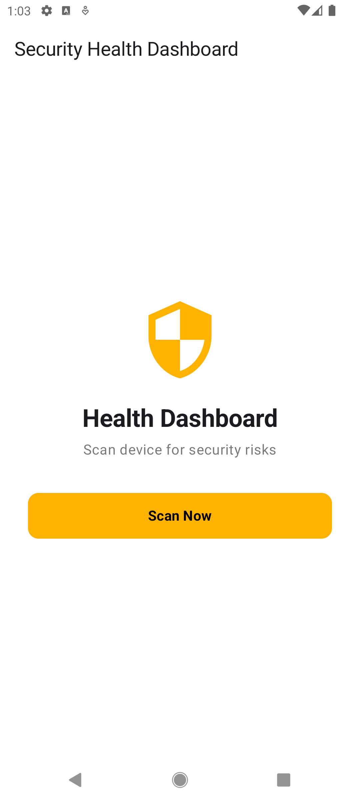
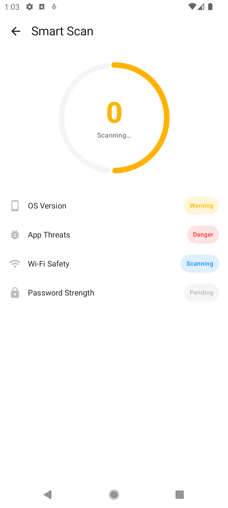
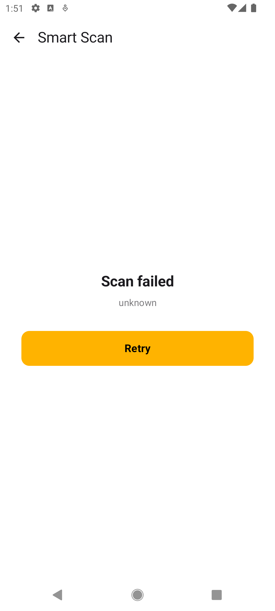
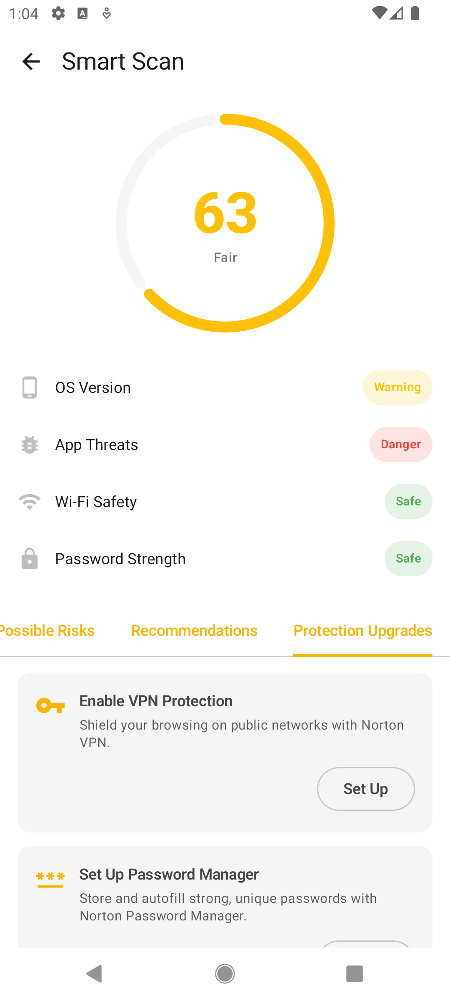
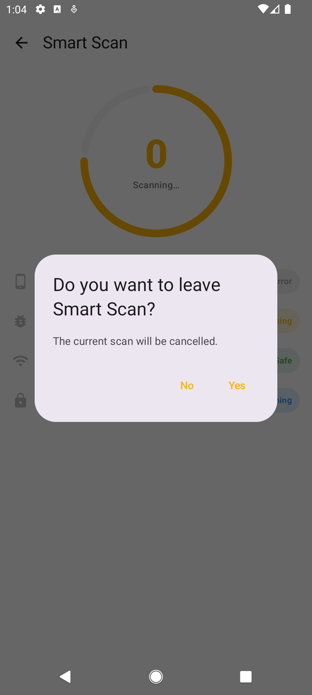

# Security Health Dashboard

Option A: Build a "Security Health Dashboard" prototype inspired by the Smart Scan experience from Norton 360.

This project was created as an AI-first internship assignment focused on:

* AI-assisted Android development
* Modern Android architecture
* UI/UX implementation
* State management
* Testing
* Engineering workflow documentation

# Project Overview

Security Health Dashboard is a prototype Android application that simulates a mobile security scanning experience.

The application contains:

* Home dashboard screen
* Smart Scan simulation screen
* Sequential security checks
* Animated scan progress
* Security recommendations pager
* Mock API/repository architecture
* Error handling
* Unit testing

All scan data and delays are fully mocked.

# Tech Stack

* Kotlin
* Jetpack Compose
* Material 3
* MVI Architecture
* Kotlin StateFlow
* Kotlin Channel (one-time events)
* Koin Dependency Injection
* Jetpack Compose Navigation
* Coroutines + Flows
* JUnit

# Architecture

The project uses a clean single-module architecture organized by feature.

```text
com.norton.securitydashboard
├── data
├── di
├── domain
│   ├── model
│   └── repository
├── feature
│   ├── home
│   └── scan
│       └── components
├── navigation
└── ui
    ├── components
    └── theme
```

Architecture principles:

* UI separated from business logic
* Repository abstraction
* Immutable UI state
* Unidirectional state flow
* Reusable Compose components
* Mock API simulation

# Features

## Home Screen

* Scan Now button
* Pull-to-refresh support
* Navigation to Smart Scan

## Smart Scan Screen

* Automatic scan start
* Animated progress indicator
* Sequential security checks
* Animated score updates
* Error state handling
* Back navigation interception during scan

### Security Categories

* OS Version
* App Threats
* Wi‑Fi Safety
* Password Strength

## Scan Results

* Final security score
* Horizontal pager with:

    * Possible Risks
    * Recommendations
    * Protection Upgrades

### Reusable Components

* CircularScoreIndicator
* RecommendationCard
* SecurityCheckItem
* PrimaryActionButton
* StatusBadge

# Testing

The project contains 6 unit tests covering:

* ViewModel state transitions
* Scan completion logic
* Error handling
* Score mapping
* Back button behavior
* Scan cancellation

One test is explicitly marked as:

```kotlin
// AI-generated, reviewed and refined by me
```

as required by the assignment.

# AI Interaction Log

## Prompt 1 — Architecture & Domain Models

### Goal

Create the initial architecture, package structure, and domain models.

### Prompt

```text
You are a Senior Android Engineer at Norton (Gen).

I'm building the Security Health Dashboard prototype.

The complete product layout, behaviors, colors, and requirements are written in docs/spec.md. Read the entire file first.

Let's begin with Phase 1 – Architecture & Domain Models.

Please provide:
1. A clean single-module package structure
2. Plain Kotlin domain models
3. A single immutable UI State class

Keep everything simple and clean.
```

### Result

Claude generated:

* initial package structure
* domain models
* scan state models
* feature-based architecture plan

### My Refinements

* Simplified package structure
* Removed unnecessary complexity
* Adjusted architecture for internship scope

## Prompt 2 — Package Cleanup & Refactor

### Goal

Normalize package structure and remove incorrect naming.

### Prompt

```text
Change the package name to:
applicationId = "com.norton.securitydashboard"

Delete the old package structure.
Move MainActivity and theme files into the new package.
Fix all imports and package declarations.
```

### Result

Claude:

* renamed package structure
* updated Gradle configuration
* cleaned imports

### My Refinements

* verified no leftover packages remained
* manually checked all imports/build issues

## Prompt 3 — Repository Layer

### Goal

Create repository abstraction and mock scan simulation.

### Prompt

```text
Create:
1. ScanRepository interface
2. MockScanRepository implementation

Use Kotlin Flow with sequential scan updates and mock delays.
```

### Result

Claude generated:

* repository abstraction
* mock scan simulation
* Flow-based updates
* delayed scan behavior

### My Refinements

* renamed repository implementation
* simplified DI structure
* manually reviewed scan timing behavior

## Prompt 4 — UI & ViewModels

### Goal

Generate screens, ViewModels, reusable components, and state handling.

### Prompt

```text
Phase 1 and Phase 2 are complete.

Proceed to Phase 3 exactly as planned.
Create all remaining ViewModels, screens, and reusable components.
Use Koin where needed.
Follow docs/spec.md.
```

### Result

Claude generated:

* HomeScreen
* SmartScanScreen
* ScanViewModel
* HomeViewModel
* reusable UI components
* navigation handling

### My Refinements

* merged duplicate DI modules
* moved shared components into ui/components
* moved ObserveAsEvents into ui
* fixed pull-to-refresh navigation behavior
* manually adjusted UI structure and package organization

## Prompt 5 — Testing

### Goal

Generate required unit tests.

### Prompt

```text
Create at least 3 unit tests.
Cover state transitions, score calculation, and cancellation behavior.
```

### Result

Claude generated:

* ScanViewModelTest
* coroutine-based tests
* fake repositories
* event/cancellation tests

### My Refinements

* renamed several functions for clarity
* reviewed test naming
* verified coroutine behavior manually

## Prompt 6 — Final AI Review

### Goal

Perform a final engineering review.

### Prompt

```text
Review the entire project.

Focus ONLY on:
- requirement compliance
- architecture
- package structure
- StateFlow + Channel usage
- Compose best practices
- test quality
- overengineering

Give concise actionable improvements.
```

### Result

Claude identified:

* pull-to-refresh navigation mismatch
* naming cleanup opportunities
* scrollability issue
* Compose stability optimization

### My Refinements

* fixed pull-to-refresh navigation
* renamed repository implementation
* added @Stable annotation
* manually reviewed final package structure

# AI Workflow Reflection

This project taught me that AI-assisted engineering works best when the developer acts as the technical lead rather than treating the AI as a full autonomous generator.

The most important lesson was that structured documentation significantly improves AI output quality.

Instead of repeatedly rewriting requirements inside prompts, I created a dedicated spec.md file that acted as the single source of truth for the project.

The most effective workflow was:

1. Define architecture first
2. Build repository/data layer
3. Generate ViewModels and state handling
4. Generate UI components
5. Add testing
6. Perform AI-assisted review and cleanup

I also learned that iterative prompting produces more stable and maintainable code than attempting to generate the entire application in one large prompt.

AI significantly accelerated:

* architecture scaffolding
* state management setup
* UI boilerplate
* test generation
* review and cleanup

However, manual engineering decisions were still necessary for:

* package organization
* architecture simplification
* cleanup of duplicate structures
* requirement verification
* UX adjustments

# Norton UX Observations

While analyzing the Norton 360 app experience, I noticed several UX patterns that influenced this prototype.

## Strong UX Patterns

### Progressive Feedback

Norton gradually reveals scan progress category-by-category instead of instantly displaying a result.

This creates:

* perceived intelligence
* user engagement
* stronger sense of system activity

I replicated this using sequential Flow emissions and animated progress updates.

### Clear Security Status Communication

The use of color-coded security states makes scan results easy to understand immediately.

I reused this pattern with:

* Success
* Warning
* Danger
* Error

### Recommendation-Based UX

Instead of only reporting problems, Norton immediately suggests actions.

This improves:

* usability
* perceived product value
* onboarding into premium/security features

### High Visual Focus on Score

The large security score indicator acts as the emotional center of the experience.

I recreated this using an animated circular progress component.

## Areas That Could Be Improved

### Scan Transparency

Real security apps sometimes feel vague about what is actually happening during scans.

Adding:

* more detailed explanations
* expandable technical information
* clearer scan timing

could improve trust.

### Recommendation Prioritization

Some recommendation cards in security apps can feel equally important even when risk severity differs.

A stronger severity hierarchy could improve UX clarity.

### Reduced Cognitive Density

Security dashboards often display too many actions simultaneously.

A more adaptive layout with progressive disclosure could improve readability.

# Build & Run

## Clone Repository

```bash
git clone "https://github.com/KirillYakub/norton-aifirst-intern-kyrylo_yakubchynskyi.git"
```

Or download the release .apk file directly from GitHub.

## Build Project

```bash
./gradlew assembleDebug
```
And launch app on your device.

## Run Tests

```bash
./gradlew test
```

# Screenshots

### Home Screen


### Smart Scan


### Scan Fail


### Scan Results


### Back Dialog


# Demo Video

The demo video includes:

* app demo
* code walkthrough
* AI workflow explanation
``` ```